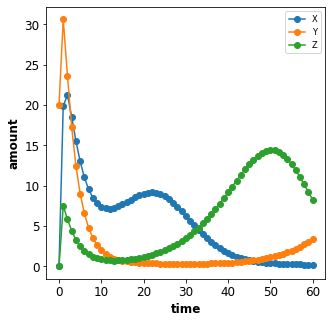
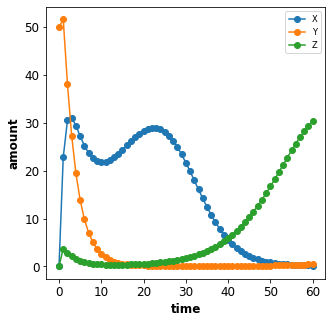
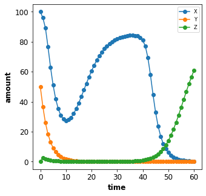

JSON simulation language
========================

For simple exchange of simulation descriptions a JSON format for the
simulation was developed. The files for the code examples are available
from
https://github.com/matthiaskoenig/sbmlsim/tree/develop/docs/notebooks

.. code:: ipython3

    import sbmlsim
    print(sbmlsim.__version__)

.. parsed-literal::

    0.1.0a1

Timecourse simulation
---------------------

In the first example we create a simple timecourse simulation for the
repressilator model. The simulation starts at ``start`` ends at ``end``
and has ``steps`` intervals (or ``steps+1`` points).

.. code:: ipython3

    from sbmlsim.timecourse import Timecourse, TimecourseSim
    
    tcsim = TimecourseSim(Timecourse(start=0, end=60, steps=60))

We can convert the timecourse simulation into JSON via

.. code:: ipython3

    json_str = tcsim.to_json()
    print(json_str)

.. parsed-literal::

    {
      "timecourses": [
        {
          "start": 0,
          "end": 60,
          "steps": 60,
          "changes": {},
          "model_changes": {}
        }
      ],
      "selections": null,
      "reset": true
    }

By providing a file path we can store the definition as json file

.. code:: ipython3

    tcsim.to_json('./json_examples/example_1.json')

We can now run the simulation with a given model, here with the
``repressilator`` model and have a look at the numerical results.

.. code:: ipython3

    from sbmlsim.simulation_serial import SimulatorSerial as Simulator
    
    simulator = Simulator("./models/repressilator.xml")
    result = simulator.timecourses(tcsim)
    print(result)

.. parsed-literal::

    <class 'sbmlsim.result.Result'>
    DataFrames: 1
    Shape: (61, 42, 1)
    Size (bytes): 20496

.. code:: ipython3

    # get timecourse data
    result.mean.to_csv('./json_examples/example_1.tsv', index=False, sep='\t')
    result.mean

.. parsed-literal::

    WARNING:root:For a single simulation the mean is the actual simulation

.. raw:: html

    

    
    <table border="1" class="dataframe">
      <thead>
        <tr style="text-align: right;">
          <th></th>
          <th>time</th>
          <th>PX</th>
          <th>PY</th>
          <th>PZ</th>
          <th>X</th>
          <th>Y</th>
          <th>Z</th>
          <th>eff</th>
          <th>n</th>
          <th>KM</th>
          <th>...</th>
          <th>Reaction10</th>
          <th>Reaction11</th>
          <th>Reaction12</th>
          <th>cell</th>
          <th>[PX]</th>
          <th>[PY]</th>
          <th>[PZ]</th>
          <th>[X]</th>
          <th>[Y]</th>
          <th>[Z]</th>
        </tr>
      </thead>
      <tbody>
        <tr>
          <td>0</td>
          <td>0.0</td>
          <td>0.000000</td>
          <td>0.000000</td>
          <td>0.000000</td>
          <td>0.000000</td>
          <td>20.000000</td>
          <td>0.000000</td>
          <td>20.0</td>
          <td>2.0</td>
          <td>40.0</td>
          <td>...</td>
          <td>30.000000</td>
          <td>30.000000</td>
          <td>30.000000</td>
          <td>1.0</td>
          <td>0.000000</td>
          <td>0.000000</td>
          <td>0.000000</td>
          <td>0.000000</td>
          <td>20.000000</td>
          <td>0.000000</td>
        </tr>
        <tr>
          <td>1</td>
          <td>1.0</td>
          <td>81.440426</td>
          <td>188.382020</td>
          <td>42.641364</td>
          <td>19.903426</td>
          <td>30.615526</td>
          <td>7.491014</td>
          <td>20.0</td>
          <td>2.0</td>
          <td>40.0</td>
          <td>...</td>
          <td>14.058083</td>
          <td>5.854689</td>
          <td>1.322932</td>
          <td>1.0</td>
          <td>81.440426</td>
          <td>188.382020</td>
          <td>42.641364</td>
          <td>19.903426</td>
          <td>30.615526</td>
          <td>7.491014</td>
        </tr>
        <tr>
          <td>2</td>
          <td>2.0</td>
          <td>218.538704</td>
          <td>358.026782</td>
          <td>84.588884</td>
          <td>21.233519</td>
          <td>23.608864</td>
          <td>5.866252</td>
          <td>20.0</td>
          <td>2.0</td>
          <td>40.0</td>
          <td>...</td>
          <td>5.506924</td>
          <td>1.001491</td>
          <td>0.399478</td>
          <td>1.0</td>
          <td>218.538704</td>
          <td>358.026782</td>
          <td>84.588884</td>
          <td>21.233519</td>
          <td>23.608864</td>
          <td>5.866252</td>
        </tr>
        <tr>
          <td>3</td>
          <td>3.0</td>
          <td>337.622362</td>
          <td>469.625864</td>
          <td>113.054468</td>
          <td>18.544097</td>
          <td>17.234851</td>
          <td>4.403620</td>
          <td>20.0</td>
          <td>2.0</td>
          <td>40.0</td>
          <td>...</td>
          <td>3.364327</td>
          <td>0.444850</td>
          <td>0.245856</td>
          <td>1.0</td>
          <td>337.622362</td>
          <td>469.625864</td>
          <td>113.054468</td>
          <td>18.544097</td>
          <td>17.234851</td>
          <td>4.403620</td>
        </tr>
        <tr>
          <td>4</td>
          <td>4.0</td>
          <td>428.938247</td>
          <td>536.662776</td>
          <td>131.034639</td>
          <td>15.559775</td>
          <td>12.482022</td>
          <td>3.295798</td>
          <td>20.0</td>
          <td>2.0</td>
          <td>40.0</td>
          <td>...</td>
          <td>2.584705</td>
          <td>0.288379</td>
          <td>0.195576</td>
          <td>1.0</td>
          <td>428.938247</td>
          <td>536.662776</td>
          <td>131.034639</td>
          <td>15.559775</td>
          <td>12.482022</td>
          <td>3.295798</td>
        </tr>
        <tr>
          <td>...</td>
          <td>...</td>
          <td>...</td>
          <td>...</td>
          <td>...</td>
          <td>...</td>
          <td>...</td>
          <td>...</td>
          <td>...</td>
          <td>...</td>
          <td>...</td>
          <td>...</td>
          <td>...</td>
          <td>...</td>
          <td>...</td>
          <td>...</td>
          <td>...</td>
          <td>...</td>
          <td>...</td>
          <td>...</td>
          <td>...</td>
          <td>...</td>
        </tr>
        <tr>
          <td>56</td>
          <td>56.0</td>
          <td>218.684319</td>
          <td>113.893055</td>
          <td>1011.838390</td>
          <td>0.257358</td>
          <td>2.171448</td>
          <td>11.909906</td>
          <td>20.0</td>
          <td>2.0</td>
          <td>40.0</td>
          <td>...</td>
          <td>0.076763</td>
          <td>1.000240</td>
          <td>3.320778</td>
          <td>1.0</td>
          <td>218.684319</td>
          <td>113.893055</td>
          <td>1011.838390</td>
          <td>0.257358</td>
          <td>2.171448</td>
          <td>11.909906</td>
        </tr>
        <tr>
          <td>57</td>
          <td>57.0</td>
          <td>205.724492</td>
          <td>121.680149</td>
          <td>1021.009829</td>
          <td>0.246437</td>
          <td>2.434108</td>
          <td>11.063379</td>
          <td>20.0</td>
          <td>2.0</td>
          <td>40.0</td>
          <td>...</td>
          <td>0.075928</td>
          <td>1.121739</td>
          <td>2.952823</td>
          <td>1.0</td>
          <td>205.724492</td>
          <td>121.680149</td>
          <td>1021.009829</td>
          <td>0.246437</td>
          <td>2.434108</td>
          <td>11.063379</td>
        </tr>
        <tr>
          <td>58</td>
          <td>58.0</td>
          <td>193.568968</td>
          <td>130.811333</td>
          <td>1023.677923</td>
          <td>0.238278</td>
          <td>2.728748</td>
          <td>10.156582</td>
          <td>20.0</td>
          <td>2.0</td>
          <td>40.0</td>
          <td>...</td>
          <td>0.075690</td>
          <td>1.257369</td>
          <td>2.592688</td>
          <td>1.0</td>
          <td>193.568968</td>
          <td>130.811333</td>
          <td>1023.677923</td>
          <td>0.238278</td>
          <td>2.728748</td>
          <td>10.156582</td>
        </tr>
        <tr>
          <td>59</td>
          <td>59.0</td>
          <td>182.181259</td>
          <td>141.421225</td>
          <td>1019.972101</td>
          <td>0.232563</td>
          <td>3.058478</td>
          <td>9.218230</td>
          <td>20.0</td>
          <td>2.0</td>
          <td>40.0</td>
          <td>...</td>
          <td>0.076022</td>
          <td>1.408327</td>
          <td>2.250004</td>
          <td>1.0</td>
          <td>182.181259</td>
          <td>141.421225</td>
          <td>1019.972101</td>
          <td>0.232563</td>
          <td>3.058478</td>
          <td>9.218230</td>
        </tr>
        <tr>
          <td>60</td>
          <td>60.0</td>
          <td>171.525463</td>
          <td>153.656610</td>
          <td>1010.202008</td>
          <td>0.229053</td>
          <td>3.426504</td>
          <td>8.275754</td>
          <td>20.0</td>
          <td>2.0</td>
          <td>40.0</td>
          <td>...</td>
          <td>0.076915</td>
          <td>1.575792</td>
          <td>1.932076</td>
          <td>1.0</td>
          <td>171.525463</td>
          <td>153.656610</td>
          <td>1010.202008</td>
          <td>0.229053</td>
          <td>3.426504</td>
          <td>8.275754</td>
        </tr>
      </tbody>
    </table>
    
61 rows × 42 columns

    

Now we create a small helper for plotting the results which we will
reuse in the following examples.

.. code:: ipython3

    %matplotlib inline
    from sbmlsim import plotting_matplotlib
    from matplotlib import pyplot as plt
    
    def plot_repressilator_result(result):
        df = result.mean
        fig, (ax) = plt.subplots(nrows=1, ncols=1, figsize=(5, 5))
    
        ax.plot(df.time, df.X, 'o-', label="X")
        ax.plot(df.time, df.Y, 'o-', label="Y")
        ax.plot(df.time, df.Z, 'o-', label="Z")
    
        ax.set_xlabel("time")
        ax.set_ylabel("amount")
        ax.legend()
        plt.show()
        
    plot_repressilator_result(result)

Model changes
-------------

A simulation without changing anything in the model is a bit boring, so
in the following we add changes to the model at the beginning of a
simulation. Such changes can either be changes in the initial amount of
a species, initial concentration of a species or parameter values.

Changes are defined via the ``changes`` field in a timecourse. The
referencing of model objects (species or parameters) works hereby via
the ``SId``, i.e. the SBML identifiers used in the SBML model.

Parameter changes
~~~~~~~~~~~~~~~~~

To change parameter values add the assignment of the change to the
``changes`` dictionary. In the example the parameter with id ``n`` is
changed to ``5`` in the simulation by adding the changes ``{'n': 5}`` to
the ``Timecourse`` object.

.. code:: ipython3

    ex_id = 2
    simulator = Simulator("./models/repressilator.xml")
    tcsim = TimecourseSim(
        Timecourse(start=0, end=60, steps=60, changes={'n': 5})
    )
    result = simulator.timecourses(tcsim)
    plot_repressilator_result(result)
    
    tcsim.to_json(f'./json_examples/example_{ex_id}.json')
    result.mean.to_csv(f'./json_examples/example_{ex_id}.tsv', index=False, sep='\t')
    print(tcsim.to_json())

.. parsed-literal::

    WARNING:root:For a single simulation the mean is the actual simulation

.. image:: simjson_files/simjson_14_1.png

.. parsed-literal::

    {
      "timecourses": [
        {
          "start": 0,
          "end": 60,
          "steps": 60,
          "changes": {
            "n": 5
          },
          "model_changes": {}
        }
      ],
      "selections": null,
      "reset": true
    }

Initial amount changes
~~~~~~~~~~~~~~~~~~~~~~

To change the initial amount of a species ``X`` to ``100`` we add the
corresponding changes ``{'X': 100}`` to the ``Timecourse``.

.. code:: ipython3

    ex_id = 3
    simulator = Simulator("./models/repressilator.xml")
    tcsim = TimecourseSim(
        Timecourse(start=0, end=60, steps=60, changes={'X': 100})
    )
    result = simulator.timecourses(tcsim)
    plot_repressilator_result(result)
    
    tcsim.to_json(f'./json_examples/example_{ex_id}.json')
    result.mean.to_csv(f'./json_examples/example_{ex_id}.tsv', index=False, sep='\t')
    print(tcsim.to_json())

.. parsed-literal::

    WARNING:root:For a single simulation the mean is the actual simulation

.. image:: simjson_files/simjson_16_1.png

.. parsed-literal::

    {
      "timecourses": [
        {
          "start": 0,
          "end": 60,
          "steps": 60,
          "changes": {
            "X": 100
          },
          "model_changes": {}
        }
      ],
      "selections": null,
      "reset": true
    }

Initial concentration changes
~~~~~~~~~~~~~~~~~~~~~~~~~~~~~

To change the initial concentration of a species ``Y`` to ``50`` in the
simulation we add the changes ``{'[Y]': 50}`` to the ``Timecourse``. The
concentrations of species are referenced via the bracket syntax, i.e.
``[Y]`` is the concentration of ``Y``, whereas ``Y`` is the amount of
``Y``.

**Note:** For the repressilator model the volume in which the species
are located is ``1.0``, so that changes in amount correspond to changes
in concentration.

.. code:: ipython3

    ex_id = 4
    simulator = Simulator("./models/repressilator.xml")
    tcsim = TimecourseSim(
        Timecourse(start=0, end=60, steps=60, changes={'[Y]': 50})
    )
    result = simulator.timecourses(tcsim)
    plot_repressilator_result(result)
    
    tcsim.to_json(f'./json_examples/example_{ex_id}.json')
    result.mean.to_csv(f'./json_examples/example_{ex_id}.tsv', index=False, sep='\t')
    print(tcsim.to_json())

.. parsed-literal::

    WARNING:root:For a single simulation the mean is the actual simulation

.. parsed-literal::

    {
      "timecourses": [
        {
          "start": 0,
          "end": 60,
          "steps": 60,
          "changes": {
            "[Y]": 50
          },
          "model_changes": {}
        }
      ],
      "selections": null,
      "reset": true
    }

Combined changes
~~~~~~~~~~~~~~~~

All these elementary changes can be combined and are all applied at the
beginning of the ``Timecourse``. For instance to change the amount of
``X`` to ``100``, the parameter ``n`` to ``5`` and the concentration of
``[Y]`` to ``50`` use the changes

::

    changes={'n': 5, 'X': 100, '[Y]: 50}

.. code:: ipython3

    ex_id = 5
    simulator = Simulator("./models/repressilator.xml")
    tcsim = TimecourseSim(
        Timecourse(start=0, end=60, steps=60, changes={'n': 5, 'X': 100, '[Y]': 50})
    )
    result = simulator.timecourses(tcsim)
    plot_repressilator_result(result)
    
    tcsim.to_json(f'./json_examples/example_{ex_id}.json')
    result.mean.to_csv(f'./json_examples/example_{ex_id}.tsv', index=False, sep='\t')
    print(tcsim.to_json())

.. parsed-literal::

    WARNING:root:For a single simulation the mean is the actual simulation

.. parsed-literal::

    {
      "timecourses": [
        {
          "start": 0,
          "end": 60,
          "steps": 60,
          "changes": {
            "n": 5,
            "X": 100,
            "[Y]": 50
          },
          "model_changes": {}
        }
      ],
      "selections": null,
      "reset": true
    }

Combined timecourses
--------------------

Multiple ``Timecourse`` objects can be combined to one large timecourse.
The results of the individual ``Timecourse`` are thereby concatenated.
The ``changes`` are always applied at the beginning of the individual
``Timecourse`` simulations.

The model state is persistent in the multiple timecourses, i.e. the end
state of the state variables of one Timecourse are the starting values
of the next Timecourse (with exception of state variables affected by
changes).

An example will demonstrate what is meant by this. The complete
timecourse simulation consists of 3 ``Timecourse`` parts:

-  start the first Timecourse with an initial amount of ``X=20`` and
   simulate for 120 time steps
-  set ``n=20`` in the model (while keeping the current state of all
   state variables) and continue simulating for 240 steps
-  set ``n=2`` (this is the initial value of n) and continue simulating
   for another 240 steps

The result is a single timecourse simulation consisting of 3 timecourse
parts.

.. code:: ipython3

    ex_id = 6
    simulator = Simulator("./models/repressilator.xml")
    tcsim = TimecourseSim([
        Timecourse(start=0, end=120, steps=60, changes={'X': 20}),
        Timecourse(start=0, end=240, steps=120, changes={'n': 20}),
        Timecourse(start=0, end=240, steps=120, changes={'n': 2}),
    ])
    result = simulator.timecourses(tcsim)
    plot_repressilator_result(result)
    
    tcsim.to_json(f'./json_examples/example_{ex_id}.json')
    result.mean.to_csv(f'./json_examples/example_{ex_id}.tsv', index=False, sep='\t')
    print(tcsim.to_json())

.. parsed-literal::

    WARNING:root:For a single simulation the mean is the actual simulation

.. image:: simjson_files/simjson_22_1.png

.. parsed-literal::

    {
      "timecourses": [
        {
          "start": 0,
          "end": 120,
          "steps": 60,
          "changes": {
            "X": 20
          },
          "model_changes": {}
        },
        {
          "start": 0,
          "end": 240,
          "steps": 120,
          "changes": {
            "n": 20
          },
          "model_changes": {}
        },
        {
          "start": 0,
          "end": 240,
          "steps": 120,
          "changes": {
            "n": 2
          },
          "model_changes": {}
        }
      ],
      "selections": null,
      "reset": true
    }

Fields overview
---------------

The following fields are available for ``TimecourseSim``:

-  ``selections``: which columns should be stored in the output
-  ``reset``: should the model be reset at the beginning of a
   TimecourseSim (default=True)

The following fields are available for ``Timecourse``:

-  ``start``: start time of integration
-  ``end``: end time of integration
-  ``steps``: steps in the integration, the final output has ``steps+1``
   points
-  ``changes``: dictionary of changes applied at the beginning of
   timecourse simulation
-  ``model_changes``: ``depecrated`` can be ignored

